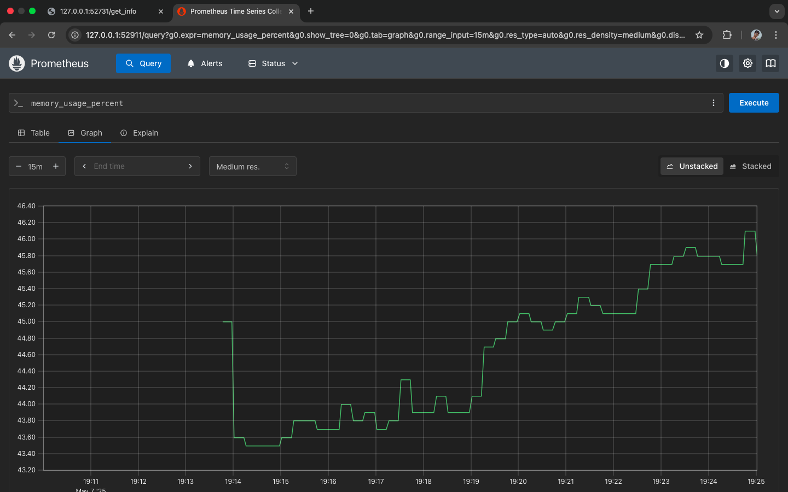

# Description

This project demonstrates a full CI/CD and monitoring setup for a backend application using FastAPI, Docker, Kubernetes, and Prometheus.

---

## ✅ Task Breakdown

### Task 1: Create Backend using FastAPI

- Endpoint: `/ or /get_info`
- Returns environment variables `APP_VERSION` and `APP_TITLE` along with the pod name (load balancer)

- Requirements

  ```txt
  fastapi
  uvicorn
  python-dotenv
  prometheus_client
  psutil
  ```

  

  ```python

  from fastapi import FastAPI, Response
  from fastapi.responses import RedirectResponse
  from prometheus_client import (
      Counter,
      generate_latest,
      Gauge,
      CONTENT_TYPE_LATEST,
  )
  from dotenv import load_dotenv
  import os
  import psutil
  import threading
  import time
  import random
  import socket

  load_dotenv()
  app = FastAPI()

  REQUEST_COUNT = Counter("get_info_requests_total", "Total number of GET /get_info requests")
  REQUEST_COUNT_PER_VERSION = Counter(
      "get_info_requests_total_by_version",
      "GET /get_info requests by app version",
      ["version"]
  )
  CPU_USAGE = Gauge("cpu_usage_percent", "CPU usage percentage")
  MEMORY_USAGE = Gauge("memory_usage_percent", "Memory usage percentage")
  UPTIME = Gauge("uptime_seconds", "App uptime in seconds")
  THREAD_COUNT = Gauge("thread_count", "Number of active threads")
  DISK_USAGE = Gauge("disk_usage_percent", "Disk usage percentage")

  START_TIME = time.time()

  @app.get("/")
  def root():
      return RedirectResponse(url="/get_info")

  @app.get("/get_info")
  async def get_info():
      app_title = os.getenv("APP_TITLE", "My FastAPI App")
      app_version = os.getenv("APP_VERSION", "1.0")

      REQUEST_COUNT.inc()
      REQUEST_COUNT_PER_VERSION.labels(version=app_version).inc()

      return {
          "APP_VERSION": app_version,
          "APP_TITLE": app_title,
          "MESSAGE": "Hello from " + socket.gethostname(),
      }

  @app.get("/metrics")
  def metrics():
      CPU_USAGE.set(psutil.cpu_percent())
      MEMORY_USAGE.set(psutil.virtual_memory().percent)
      UPTIME.set(time.time() - START_TIME)
      THREAD_COUNT.set(threading.active_count())
      DISK_USAGE.set(psutil.disk_usage("/").percent)

      return Response(generate_latest(), media_type=CONTENT_TYPE_LATEST)

  ```

  


---

### Task 2: Dockerize the Application

- Dockerfile created to containerize the FastAPI app

  ```Dockerfile
  FROM python:3.11-slim

  WORKDIR /app

  COPY app/requirements.txt .
  RUN pip install --no-cache-dir -r requirements.txt

  COPY . .

  EXPOSE 8000
  CMD ["uvicorn", "app.main:app", "--host", "0.0.0.0", "--port", "8000", "--workers", "2"]
  ```

- Image built using: `docker build -t img-2024mt03053 .`


---

### Task 3: Run Docker Container

- Run using:

  ```bash
  docker run -d --name CNR-2024MT03053 -p 8000:8000 -e APP_VERSION=1.0 -e APP_TITLE="2024MT0353-DevOps-Assignment" img-2024mt03053
  ```

---

### Task 4: Deploy Image to Kubernetes (Minikube)

- Created ConfigMap with `APP_VERSION` and `APP_TITLE`
- Deployment created with 2 replicas using the image `img-2024mt03053`
- Service exposed with loadbalancer

  ```yaml
  apiVersion: v1
  kind: ConfigMap
  metadata:
    name: config-2024mt03053
  data:
    APP_VERSION: '1.0'
    APP_TITLE: '2024MT0353-DevOps-Assignment'
  ```

  ```yaml
  apiVersion: apps/v1
  kind: Deployment
  metadata:
    name: fastapi-deployment
  spec:
    replicas: 3
    selector:
      matchLabels:
        app: fastapi-app
    template:
      metadata:
        labels:
          app: fastapi-app
      spec:
        containers:
          - name: fastapi-container
            image: img-2024mt03053:latest
            imagePullPolicy: Never
            ports:
              - containerPort: 8000
            envFrom:
              - configMapRef:
                  name: config-2024mt03053
            readinessProbe:
              httpGet:
                path: /
                port: 8000
              initialDelaySeconds: 5
              periodSeconds: 10
              failureThreshold: 3
              successThreshold: 1
  ```

  ```yaml
  apiVersion: v1
  kind: Service
  metadata:
    name: fastapi-service
  spec:
    type: LoadBalancer
    selector:
      app: fastapi-app
    sessionAffinity: None
    ports:
      - protocol: TCP
        port: 80
        targetPort: 8000
  ```

- Deploy & check the kube status
  ```bash
  kubectl apply -f k8s/ConfigMap.yaml
  kubectl apply -f k8s/Deployment.yaml
  kubectl apply -f k8s/Service.yaml
  minikube dashboard
  ```
- Deployment

  

- Status

  

- Minikube Dashboard Deployments

  

- Minikube Dashboard Service

  

- Minikube Dashboard Pods
  

---

### Task 5: Configure LoadBalancer

- Exposed app using a LoadBalancer service
- Verified service endpoint using:

  ```bash
  minikube service fastapi-service --url
  ```

---

### Task 6: Configure Prometheus

- ✅ Installed Prometheus and configured it with Kubernetes using a ConfigMap.
- ✅ Enabled system and application-level metrics via `prometheus_client`.
- ✅ Exposed a `/metrics` endpoint on the FastAPI app for Prometheus scraping.

  ```yaml
  apiVersion: v1
  kind: ConfigMap
  metadata:
    name: prometheus-config
  data:
    prometheus.yml: |
      global:
        scrape_interval: 15s  
      scrape_configs:
        - job_name: 'fastapi'
          static_configs:
            - targets: ['fastapi-service:80']
  ```

  ```yaml
  apiVersion: apps/v1
  kind: Deployment
  metadata:
    name: prometheus
  spec:
    replicas: 1
    selector:
      matchLabels:
        app: prometheus
    template:
      metadata:
        labels:
          app: prometheus
      spec:
        containers:
          - name: prometheus
            image: prom/prometheus:latest
            ports:
              - containerPort: 9090
            volumeMounts:
              - name: config-volume
                mountPath: /etc/prometheus/
        volumes:
          - name: config-volume
            configMap:
              name: prometheus-config
  ```

  ```yaml
  apiVersion: v1
  kind: Service
  metadata:
    name: prometheus-service
  spec:
    type: NodePort
    selector:
      app: prometheus
    ports:
      - port: 9090
        targetPort: 9090
        nodePort: 30000
  ```

- Deploy & check the kube status
  ```bash
  kubectl apply -f prometheus/ConfigMap.yaml
  kubectl apply -f prometheus/Deployment.yaml
  kubectl apply -f prometheus/Service.yaml
  ```

## 🔍 Visualized Metrics

| Metric Name                          | Description                                    |
| ------------------------------------ | ---------------------------------------------- |
| `get_info_requests_total`            | Total number of `GET /get_info` requests       |
| `get_info_requests_total_by_version` | Requests to `/get_info` labeled by app version |
| `cpu_usage_percent`                  | Current CPU usage percentage                   |
| `memory_usage_percent`               | Current memory usage percentage                |
| `uptime_seconds`                     | Uptime of the application in seconds           |
| `thread_count`                       | Number of active threads                       |
| `disk_usage_percent`                 | Disk usage percentage of root filesystem       |

## 📈 Sample Prometheus Queries

```promql
# Total requests
get_info_requests_total
```


```promql
# Current CPU and memory usage
cpu_usage_percent
memory_usage_percent
```




```promql
# App uptime
uptime_seconds
```


```promql
# Disk usage
disk_usage_percent
```


## 🧪 Accessing Prometheus

If running via NodePort:

```
http://<your-node-ip>:30000
```

Or using `kubectl` port-forward:

```bash
kubectl port-forward svc/prometheus-service 9090:9090
```

Then open your browser to:

```
http://localhost:9090
```

---

## 📁 Directory Structure

```

├── Dockerfile
├── README.md
├── app
│   ├── main.py
│   └── requirements.txt
├── k8s
│   ├── ConfigMap.yaml
│   ├── Deployment.yaml
│   └── Service.yaml
├── prometheus
│   ├── ConfigMap.yaml
│   ├── Deployment.yaml
│   └── Service.yaml
└── screenshots
    ├── app-response.png
    ├── application-init.png
    ├── application-running-local.png
    ├── cpu-usage.png
    ├── curl-logs.png
    ├── curl-test.png
    ├── disk-usage.png
    ├── docker-image-build.png
    ├── get-total-requests.png
    ├── kube-deployments.png
    ├── kube-pods.png
    ├── kube-services.png
    ├── kubectl-pods-deploy.png
    ├── kubectl-pods-status.png
    ├── memory-usage.png
    ├── minikube-start.png
    ├── target-status.png
    └── uptime-seconds.png
```

---

## 📝 Challenges faced

- Helm installation: Tried Helm but faced some env issues

- K3s: Lightweight K8s again env issues

- Minikube: worked in both linux and mac.

---
